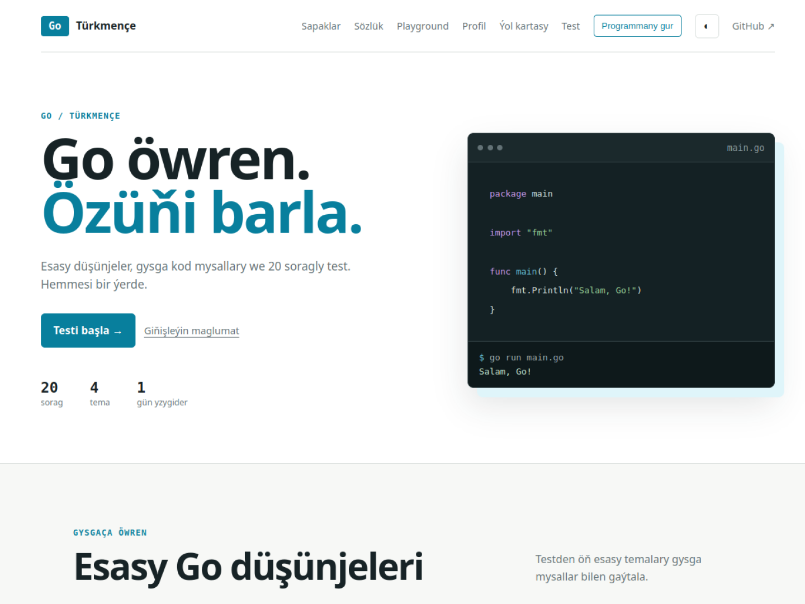

  

  <h1>Go türkmençe</h1>
  
Go programmirleme dilini türkmençe öwrenmek üçin açyk çeşmeli okuw çeşmesi.

Bu repozitoriýa Go diline täze başlanlar we bilimini ösdürmek isleýänler üçin türkmençe sapaklary, kod mysallaryny, testleri, algoritmleri hem-de amaly gollanmalary birleşdirýär.

**Website:** [go.dayanch.dev](https://go.dayanch.dev/)

Taslama peýdaly bolsa, GitHub-da ýyldyz berip we beýleki öwrenijiler bilen paýlaşyp bilersiň.

## Go barada

Go — Google-da döredilen, açyk çeşmeli, statiki görnüşli we kompýuter tarapyndan düzülýän programmirleme dilidir. Ol ýönekeý sintaksisi, çalt build prosesi, güýçli standart kitaphanasy we concurrency goldawy bilen tapawutlanýar.

Go esasan backend hyzmatlary, CLI programmalary, ulgam gurallary, bulut infrastrukturalary we paýlanan ulgamlar üçin ulanylýar. Diliň resmi ady **Go**, `Golang` bolsa internetde gözleg etmekde we domen atlarynda giňden ulanylýan atdyr.

Resmi çeşmeler:

- [Go resmi web sahypasy](https://go.dev/)
- [Go dokumentasiýasy](https://go.dev/doc/)
- [A Tour of Go](https://go.dev/tour/)
- [Go Playground](https://go.dev/play/)

## Esasy bölümler

| Bölüm | Mazmuny |
|---|---|
| [Go temalary](go-temalary/README.md) | Go diliniň esasy düşünjeleri we kod mysallary |
| [Goşmaça sapaklar](gosmaca-sapaklar/README.md) | Test, HTTP, SQL, Docker we ösen temalar |
| [Interaktiw website](https://go.dayanch.dev/) | Sapaklar, test, profil, Playground we sözlük |
| [Go Cheatsheet](cheatsheet/README.md) | Sintaksisi çalt ýatlamak üçin gysga gollanma |
| [Algoritmler](algoritmler/README.md) | Gözleg, sorting, maglumat gurluşlary, BFS we DFS |
| [Design Patterns](design-patterns/README.md) | Go-da ulanylýan programma gurluş nusgalary |
| [Go testi](go-temalary/testler/readme.md) | Esasy temalar boýunça bilim barlagy |
| [Türkmençe Go sözlügi](https://go.dayanch.dev/sozluk.html) | Iňlisçe–türkmençe interaktiw termin sözlügi |
| [Amaly taslamalar](amaly-taslamalar/README.md) | Doly işleýän Go taslamalary we testler |
| [Kod ýumuşlary](kod-yumuslary/README.md) | Ýeňilden kynlaşýan programmirleme meseleleri |
| [Çözgütler](cozgutler/README.md) | Ýumuşlaryň düşündirişli çözgütleri |
| [Interview](interview/README.md) | Go iş söhbetdeşligi üçin taýýarlyk |
| [Real-world Go](real-world-go/README.md) | Production taslamalarda ulanylýan usullar |
| [Howpsuzlyk](howpsuzlyk/README.md) | Parol hash, JWT, CORS we SQL injection goragy |
| [Performance](performance/README.md) | Benchmark, profiling we memory optimizasiýasy |
| [DevOps](devops/README.md) | Docker, CI/CD, deploy we monitoring |
| [Go gurallary](go-gurallary/README.md) | Format, analiz, profiling we debugger gurallary |
| [Kitaphanalar](kitaphanalar/README.md) | Peýdaly standart we daşarky Go paketleri |
| [Terminler](terminler/README.md) | Iňlisçe–türkmençe programmirleme sözlügi |
| [Habarlar](habarlar/README.md) | Go wersiýalaryny we täzelikleri yzarlamak |
| [Jemgyýet](jemgyyet/README.md) | Türkmen Go developerleri we taslamalary |

## Go diliniň esaslary

- [Go gurmak we ilkinji programma](gosmaca-sapaklar/getting-started/readme.md)
- [Bahalar (Values)](go-temalary/values/readme.md)
- [Üýtgeýjiler (Variables)](go-temalary/variables/readme.md)
- [Hemişelikler (Constants)](go-temalary/constants/readme.md)
- [For](go-temalary/for/readme.md)
- [If–Else](go-temalary/if-else/readme.md)
- [Switch](go-temalary/switch/readme.md)
- [Massiwler (Arrays)](go-temalary/arrays/Readme.md)
- [Dilimler (Slices)](go-temalary/slices/readme.md)
- [Açar–baha toplumlary (Maps)](go-temalary/maps/readme.md)
- [Range](go-temalary/range/readme.md)
- [Funksiýalar](go-temalary/functions/readme.md)
- [Üýtgeýän parametrli funksiýalar](go-temalary/variadic-functions/readme.md)
- [Closure](go-temalary/closures/readme.md)
- [Rekursiýa](go-temalary/recursion/readme.md)
- [Pointer-ler](go-temalary/pointers/readme.md)
- [Setir funksiýalary](go-temalary/string-functions/readme.md)
- [Setirler we rune-lar](go-temalary/strings-and-runes/readme.md)
- [Struct-lar](go-temalary/structs/readme.md)
- [Method-lar](go-temalary/methods/readme.md)
- [Interface-ler](go-temalary/interfaces/readme.md)
- [Struct embedding](go-temalary/struct-embedding/readme.md)
- [Generikler](gosmaca-sapaklar/generics/readme.md)
- [Paketler we modullar](gosmaca-sapaklar/modules/readme.md)

## Ýalňyşlyklar we maglumat bilen işlemek

- [Ýalňyşlyklar (Errors)](go-temalary/errors/readme.md)
- [Panic](go-temalary/panic/readme.md)
- [Defer](go-temalary/defer/readme.md)
- [Recover](go-temalary/recover/readme.md)
- [Faýllary okamak we ýazmak](gosmaca-sapaklar/files/readme.md)
- [JSON](go-temalary/json/readme.md)
- [Tekst şablonlary](go-temalary/text-templates/readme.md)
- [Tertiplemek (Sorting)](go-temalary/sorting/readme.md)

## Concurrency

- [Goroutine-lar](go-temalary/goroutines/readme.md)
- [Channel](go-temalary/channel/readme.md)
- [Select](go-temalary/select/readme.md)
- [Timeout](go-temalary/timeouts/readme.md)
- [Bloklamaýan channel](go-temalary/non-blocking-channel/readme.md)
- [Channel-y ýapmak](go-temalary/closing-channels/readme.md)
- [Channel üstünde range](go-temalary/range-over-channels/readme.md)
- [Timer](go-temalary/timers/readme.md)
- [Ticker](go-temalary/tickers/readme.md)
- [Worker pool](go-temalary/work-pools/readme.md)
- [WaitGroup](go-temalary/wait-groups/readme.md)
- [Rate limiting](go-temalary/rate-limiting/readme.md)
- [Atomic counter](go-temalary/atomic-counters/readme.md)
- [Context](gosmaca-sapaklar/context/readme.md)

## Hakyky taslama taýýarlamak

- [Kody formatlamak we barlamak](gosmaca-sapaklar/code-quality/readme.md)
- [Test we benchmark](gosmaca-sapaklar/testing/readme.md)
- [HTTP server we REST API](gosmaca-sapaklar/http-rest-api/readme.md)
- [Middleware](gosmaca-sapaklar/middleware/readme.md)
- [Maglumat bazasy bilen işlemek](gosmaca-sapaklar/database-sql/readme.md)
- [Konfigurasiýa we environment variables](gosmaca-sapaklar/configuration/readme.md)
- [Logging](gosmaca-sapaklar/logging/readme.md)
- [Taslamanyň bukja gurluşy](gosmaca-sapaklar/project-structure/readme.md)
- [Docker we deploy](gosmaca-sapaklar/docker-deployment/readme.md)

## Öwreniş çeşmeleri

- [Täze başlanlar üçin ýol kartasy](gosmaca-sapaklar/roadmap/readme.md)
- [Go terminleriniň sözlügi](gosmaca-sapaklar/glossary/readme.md)
- [Ýumuşlar](gosmaca-sapaklar/exercises/readme.md)
- [Ýumuşlaryň nusgalyk çözgütleri](gosmaca-sapaklar/exercises/solutions.md)
- [Köp duş gelýän ýalňyşlyklar](gosmaca-sapaklar/common-mistakes/readme.md)
- [Söhbetdeşlik soraglary](gosmaca-sapaklar/interview-questions/readme.md)
- [Amaly taslama pikirleri](gosmaca-sapaklar/practical-projects/readme.md)

## Giňişleýin sapaklar

- [Go programmirleme diliniň esaslary](sapaklar/%231-Go.md)
- [Sintaksis we maglumat görnüşleri](sapaklar/%232-Go.md)
- [Paketler](sapaklar/%233-Go.md)
- [Massiwler](sapaklar/%234-Go.md)
- [Dilimler](sapaklar/%235-Go.md)

## Go boýunça iş gözlemek

- [Golang Projects](https://www.golangprojects.com/)
- [Golang Cafe Jobs](https://golang.cafe/)
- [Web3 Go Jobs](https://web3.career/golang-jobs)

## Goşant goşmak

Ýalňyşlyk tapsaň, täze tema ýa-da has gowy düşündiriş goşmak isleseň, issue açyp ýa-da pull request iberip bilersiň. Goşant goşanyňda:

1. Düşnükli türkmençe ulan.
2. Kod mysallaryny `gofmt` bilen formatla.
3. Mümkin bolsa, koduň garaşylýan çykyşyny görkez.
4. Täze sapagy degişli bölümden bagla.
